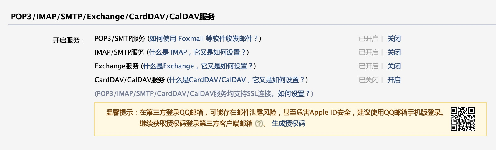
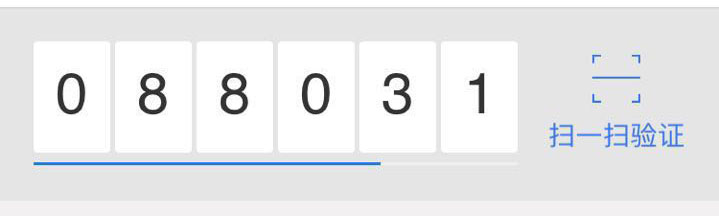
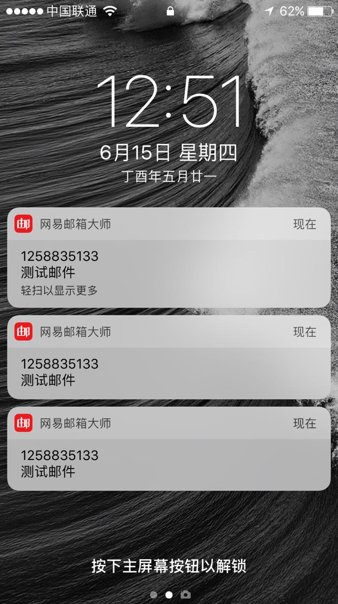

# sendMail
nodejs实现发送邮件的功能
## 下载项目
```
git colne https://github.com/zhaoxuhui1122/sendMail.git
```
## 执行安装
```
npm install 
```
## 进行项目配置
### 1 ./config／email.js
```javascript
module.exports = {
    email: {
         service:'QQ',//发信邮箱服务商
         user: '12588351**@qq.com',//发信邮箱账号
         pass: 'nwojjgubecoafhig'//发信邮箱密码，这里的密码用的安全管家生成的动态密码，下方将会 详细介绍生成方式
    }
}
```
### 2../service/email.js
```javascript
const nodemailer = require('nodemailer')
const smtpTransport = require('nodemailer-smtp-transport');
const config = require('../config/email')
//根据配置文件生成 smtpTransport
transporter = nodemailer.createTransport(smtpTransport({
    service: config.email.service,
    auth: {
        user: config.email.user,//发信人账号
        pass: config.email.pass//发信人密码
    }
}));

module.exports = function(req,res){
     transporter.sendMail({
        from: config.email.user,//发信人config
        to: req.body.adress, //adress 收件人
        subject: req.body.subject,//subject 发送的主题
        html: req.body.html//html 发送的html内容

    }, function (err, result) {
        if (err) {
            console.log(err);
            res.json("error");
        }else{
            res.json("success");
            console.log("success");
        }
        
    });
 }
```


# 关于如何配置发信箱密码
不能直接使用邮箱密码登录，下方以qq邮箱为例进行说明

### 1.打开邮箱-->设置-->服务-->POP3/IMAP/SMTP/Exchange/CardDAV/CalDAV服务,将如图几项设置为开启

### 2.点击温馨提示位置的生成授权码【用此码代替密码配置】

### 3.打开qq安全中心，将页面上的页面上的动态码输入第二部的窗口，生成一个字符串密码

### 4.将步骤三生成的密码配置进./config/email.js 的email.pass下


## 启动

```
node app.js
```

## 测试效果

打开index.html，输入邮箱，看是否能够发送成功，相关log信息去控制台查看详情

```html
	<body>
		<h1>nodejs实现邮件发送功能</h1>
		<hr />
		<div>
			<input type="email" placeholder="输入收件人邮箱地址" required="required" id="email"/>
			<button id="btn">发送邮件</button>
		</div>
	</body>
    <script>
	$(function () {
		var reg = /\w[-\w.+]*@([A-Za-z0-9][-A-Za-z0-9]+\.)+[A-Za-z]{2,14}/;
		$("#btn").click(function () {
			console.log(1)
			var email = $("#email").val();
			if(reg.test(email)){
				$.ajax({
					type:"post",
					url:"http://lcoalhost:3000/sendMail",
					async:true,
					data :{
						adress :email ,//收信人地址
						subject :"测试邮件",//邮件主题
						html :"hello World !"//邮件内容
					}
				});
			}else{
				alert("邮件格式错误！")
			}
		})
	})
</script>
```

